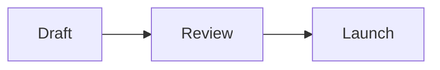

# Nativ Docs

Write either a `.md` file or one complete, self-contained `.html` file. Prefer
Markdown for normal documents; use HTML when the content needs custom layout,
visualizations, or interaction.

## Use the Nativ Docs MCP server

Document content moves between Nativ and the local disk without passing through
the conversation. Both directions work the same way: the tool returns a `curl`
command, and running it transfers the file. Reading a document into context and
writing it back out costs tokens in proportion to its size, for no benefit.

When the MCP server is available:

1. Use `list_documents` to find a document, passing `query` to filter by title,
   description, or file name. Results carry metadata only.
2. Use `get_document` to inspect one. It returns metadata by default — never
   content — including the `versionId` an update must be based on, plus
   `sizeBytes` and `checksum`. To fetch an older revision when the user does not
   know its numeric version, first call `list_document_versions`, select the
   requested revision from the returned metadata, then pass its `version` to
   `get_document`. Never guess a version number.
3. To work on a document, first check whether the destination file already
   exists. If it does, compute its SHA-256 and compare it with the `checksum`
   returned for the requested version. Reuse the local file only when the two
   digests match exactly. Otherwise, call `get_document` with an absolute
   `destinationPath` and `delivery: "file"`, run the returned command, and edit
   the downloaded file. Use `delivery: "inline"` only when you must reason over
   the prose itself; it refuses documents over 150,000 bytes and directs you
   back to `delivery: "file"`.
4. Use `list_comment_threads` to read feedback, each thread with its full reply
   chain. Pass `threadId` for a single thread, or `status: "open"` to skip
   resolved ones. Apply requested feedback while leaving unrelated text stable,
   so existing comment anchors can reconnect.
5. To save a local file, call `create_document` for a new document or
   `update_document` for a replacement, **omitting `content`** in both cases.
   Each returns a `curl` command that uploads the file directly. Pass the
   `versionId` from `get_document` as `baseVersionId` on `update_document`.
6. Replace only the placeholder absolute path in a returned command, then run
   it once. Do not read, copy, JSON-escape, or base64-encode a file merely to
   move it. Treat transfer tokens and commands as secrets: run them promptly,
   and do not echo, persist, or share them.
7. Pass `content` inline only for short text already in context with no local
   file. It is capped at 150,000 characters; anything larger must go through a
   file. Stored documents may be up to 10 MB.
8. If a transfer returns 404 or its grant has expired, request a new one. If an
   update returns a version conflict, re-read the document, merge against the
   current version, and request a new grant with the new `versionId`.
9. Use `reply_to_comment_thread` only when the user asks to post a reply. The
   MCP server can reply to existing threads but cannot create, resolve, or
   reopen them. Delete a document only after explicit confirmation.

`checksum` is the SHA-256 of a version's remote bytes. Hash the local file with
`shasum -a 256 /absolute/path` on macOS or `sha256sum /absolute/path` on Linux.
An unchanged remote checksum alone does not prove that the local file is
current; a missing, unreadable, or mismatched local file must be downloaded.

When the user wants the finished content saved to Nativ, upload the local file
with the workflow above. Otherwise return the requested `.md` or `.html` file.

## Markdown capabilities

Nativ supports:

- headings, paragraphs, emphasis, blockquotes, links, and horizontal rules;
- ordered, unordered, and task lists;
- GitHub-flavored tables, strikethrough, and autolinks;
- inline code and fenced code with syntax highlighting;
- Mermaid diagrams in fenced `mermaid` blocks;
- inline math with `$...$` and display math with `$$...$$`.

Raw HTML is sanitized. Markdown image sources are not currently portable in the
offline preview, so use Mermaid, text, or self-contained HTML for essential
visuals.

````markdown
# Launch review

The rollout is **ready for review** with two open risks.

| Area | Status |
| --- | --- |
| API | Ready |
| Migration | In progress |


````

## HTML capabilities

Nativ supports inline CSS and JavaScript, responsive layouts, inline SVG,
canvas, tables, charts, tabs, filters, and other document-local interactions.
Images and media may be embedded with modest `data:` or `blob:` URLs.

HTML runs inside a sandboxed iframe with no network access. Keep it compatible:

- Include `<!doctype html>`, `html[lang]`, UTF-8 charset, viewport metadata, and
  a useful title.
- Put all CSS and JavaScript inline. Do not use CDNs, remote fonts, `fetch`,
  XHR, WebSockets, relative assets, or server endpoints.
- Do not add a Content Security Policy, wrap the document in another iframe, or
  access `window.parent` or `window.top`.
- Use fragment links for navigation inside the document and absolute HTTPS URLs
  for external links. Forms, popups, downloads, and browser dialogs are blocked.
- Treat storage as optional and temporary. Guard `localStorage` and
  `sessionStorage` access.
- Make the layout responsive to 320 px. Avoid `overflow-x: hidden` on the root;
  Nativ needs horizontal panning at higher document zoom.
- Honor `prefers-reduced-motion` when adding animation.

```html
<!doctype html>
<html lang="en">
<head>
  <meta charset="utf-8">
  <meta name="viewport" content="width=device-width, initial-scale=1">
  <title>Project status</title>
  <style>
    * { box-sizing: border-box; }
    body { margin: 0; padding: clamp(1rem, 5vw, 4rem); font: 16px/1.6 system-ui; }
    main { width: min(100%, 48rem); margin: auto; }
    button { min-height: 44px; }
  </style>
</head>
<body>
  <main>
    <h1>Project status</h1>
    <p id="summary">The project is on track.</p>
    <button type="button" id="details">Show details</button>
  </main>
  <script>
    document.querySelector("#details").addEventListener("click", () => {
      document.querySelector("#summary").textContent = "The project is on track with two open risks.";
    });
  </script>
</body>
</html>
```

## Write documents that work well in Nativ

- Keep meaningful prose as real, selectable text in DOM reading order. Do not
  put essential text only in an image, canvas, SVG paths, generated CSS, shadow
  DOM, or nested iframe.
- Use semantic headings, lists, tables, links, landmarks, buttons, labels, alt
  text, visible focus states, and sufficient contrast.
- Keep important wording and surrounding text stable during revisions. Replace
  only the smallest dynamic region needed; large DOM rewrites can unlink
  comments.
- Do not disable text selection or clear the selection from pointer, selection,
  or context-menu handlers. Use `data-collabi-ignore` for transient decorative
  text that should not affect comment positions.
- Nativ supplies Copy, Comment, comment highlights, zoom, and presentation mode.
  On desktop, select text and open the context menu to see Copy and Comment; a
  plain left click does not open this menu.
- Keep the document continuous and scrollable so presentation mode can show all
  content. Test narrow and wide layouts, keyboard use, reduced motion, and
  50–200% document zoom.
- Deliver the raw Markdown or HTML document, not an exported viewer wrapper
  containing the real document inside `iframe[srcdoc]`.
